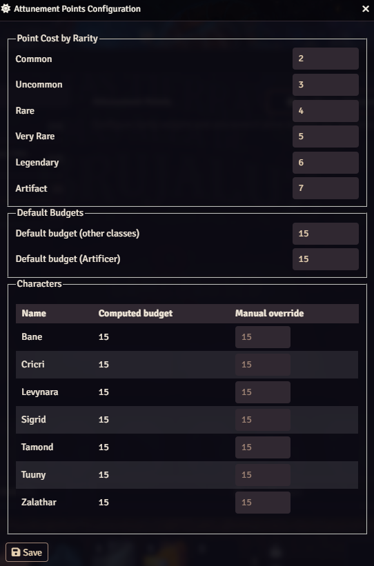
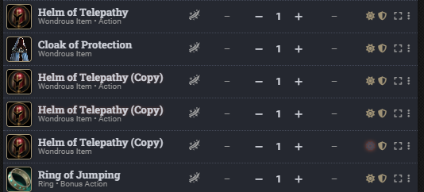
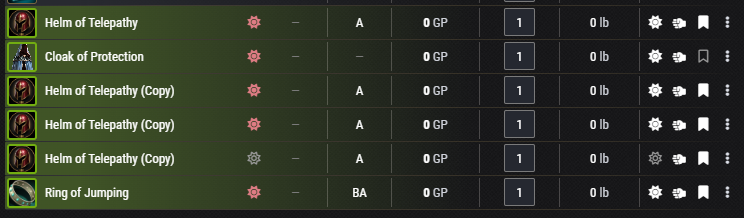

# At-Tuned

   

A Foundry VTT module that replaces D&D5e's fixed 3-item attunement limit with a per-character point budget, weighted by item rarity, with special support for the Artificer class.

## Requirements

- Foundry VTT v13.341+
- dnd5e system v4+
- Tidy5e Sheet (optional) — the counter shows correctly with no extra setup, since the module reuses dnd5e's own attunement fields
- [lib-wrapper](https://foundryvtt.com/packages/lib-wrapper) (optional, recommended) — enables precise calculation of the weighted attunement value directly on the data model. Without it, the module falls back to recalculating on relevant hooks (item/actor changes), which is a bit less immediate but still fully functional.

## What it does

### A point budget instead of a fixed count

From **Configure Settings**, the GM opens the module's own configuration screen to set:

- The point cost of each item rarity.
- A default point budget for regular classes, and a separate default for Artificer.
- An optional manual override per player character.

### Weighted by rarity

Each rarity costs a different amount of the budget (fully configurable, these are just the defaults):

| Rarity | Points |
|---|---|
| Common | 2 |
| Uncommon | 3 |
| Rare | 4 |
| Very Rare | 5 |
| Legendary | 6 |
| Artifact | 7 |

### Special budget for Artificer

The module detects Artificer levels automatically and applies the Artificer default budget instead of the regular one — no manual tagging needed per character.

### Hard cap enforcement

Unlike the vanilla rule (which is just an honor-system counter), attuning an item that would exceed the character's point budget is blocked outright, with a clear warning explaining why.

### Works with the default sheet and Tidy5e Sheet

The module reuses dnd5e's own attunement counter fields instead of building a separate widget, so both sheets display the weighted total and budget correctly out of the box.

Default sheet:

Tidy5e Sheet:

## Language

The interface is translated into **English and Spanish**, and automatically follows the language each user has configured in Foundry (Configuration > Language) — no extra setup needed from the GM.
